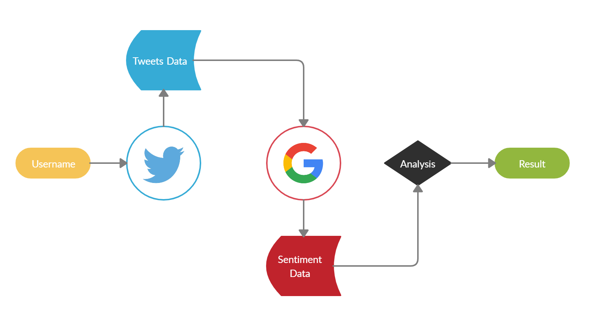
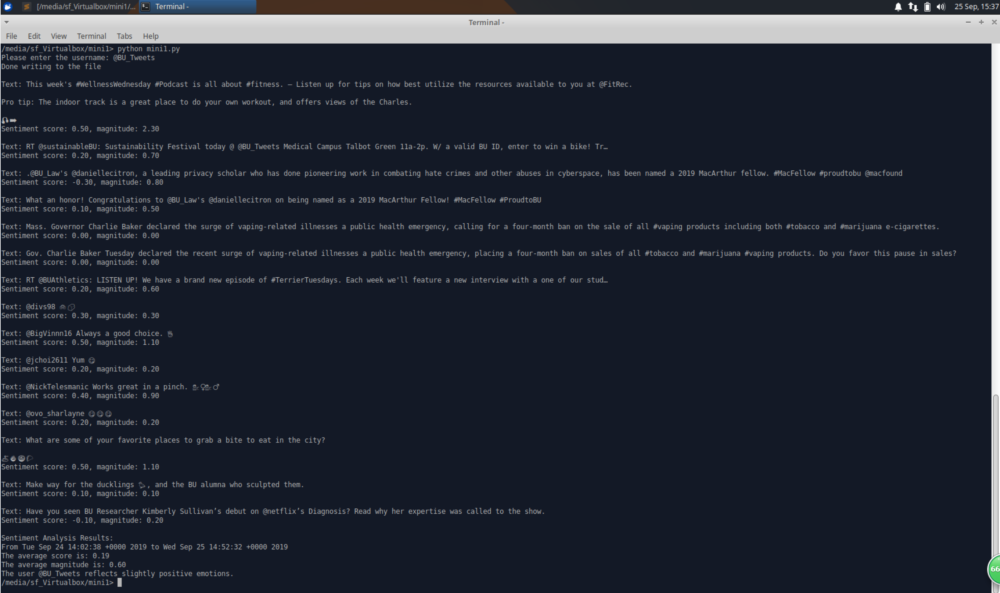

# EC601 Mini Project 1

## Product Mission

### Project Defination:
This project aims at performing sentiment analysis on tweets using tweeter API and google natural language API. 
Users can grab tweets from a particular user and get a sentiment score on the tweets. 
This can be helpful in social media sentiment analysis.

### User Stories:
Alan as the project manager in his company wants to test the integrity of the Qianqian’s project team member through current state that his employee hired recently.

### Target Users:
Project manager, team leader.

### MVP:

## System Design

### System Diagram:

### System Construction:
1. As the system diagram shows, two packages from github (tweepy and google api) are requeired. 
2. After cloning this mini project  and requried package into the targeted directory, open the mini.py and type in the username of the person you want to test with. 
3. Run the mini.py on the terminal.

## Testing Result:

This test is based on the BU official account. The system sampled the most recent ten posts. It analyze the content of the post and give a score between 0.5 ~ -0.5, from postive feeling to negative feeling. The system also throws back a magnitude of entity. The eventual result is the average score and the average magnitude of entity. The official account should be positive (positive score)  and moderate (low magnitude), which matched the expected result.

## Lessons Learned:
More test sample and more time could give this system more detailed sentimental analysis. For example, the system can display what type of tweet that the tester like to post and get to know the person's point of interest and what (he/she) is good at.
